# 박동규 교수의 저서 목록

| 이미지 	| 내용  	|
|---	|---		|
| 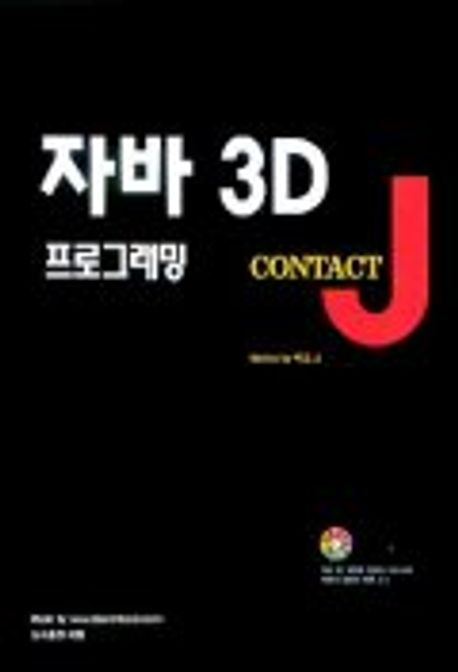 	          | * 제목 : 자바 3D 프로그래밍  * 저자 : 박동규  * 출간 연도 : 2000년  * 출간사 : 도서출판 대림  	|
| 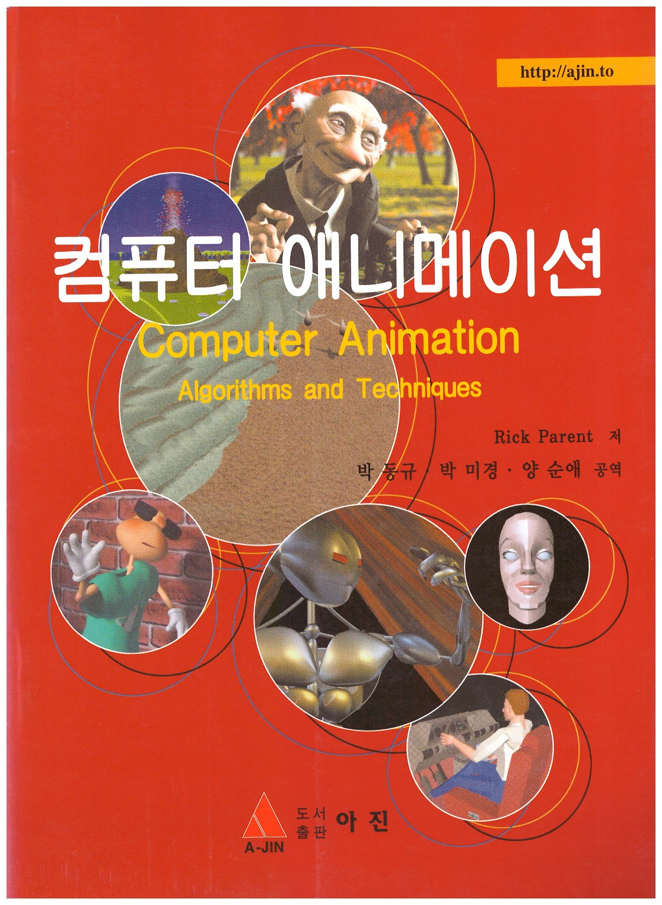 	      | * 제목 : 컴퓨터 애니메이션 * 저자 : 박동규, 박미정, 양순애  * 출간 연도 : 2004년 10월  * 출간사 : 도서출판 아진  	|
| 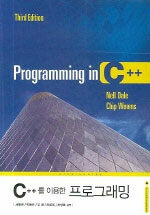 	          | * 제목 : C++을 이용한 프로그래밍(3rd)  * 저자 : 서동근, 박동규 등  * 출간 연도 : 2006년  * 출간사 : 사이텍미디어 
| 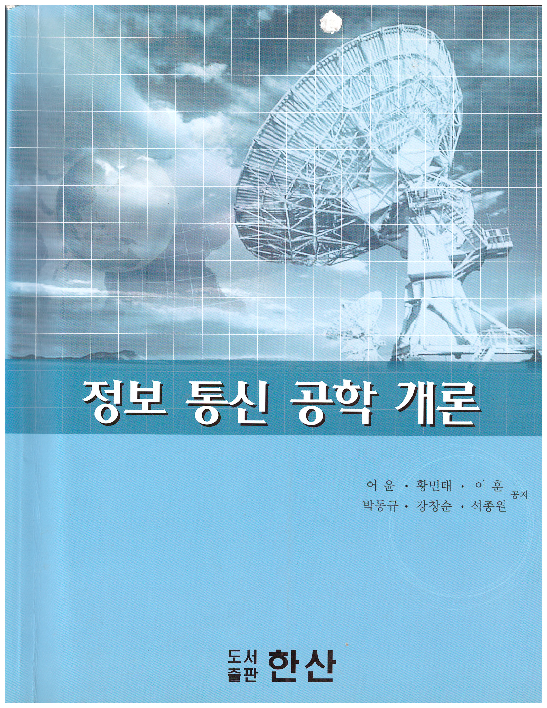 	      | * 제목 : 정보통신공학개론 * 저자 : 어윤, 황민태, 이훈, 박동규, 강창순, 석종원  * 출간 연도 : 2007년 3월  * 출간사 : 도서출판 한산  	||
| 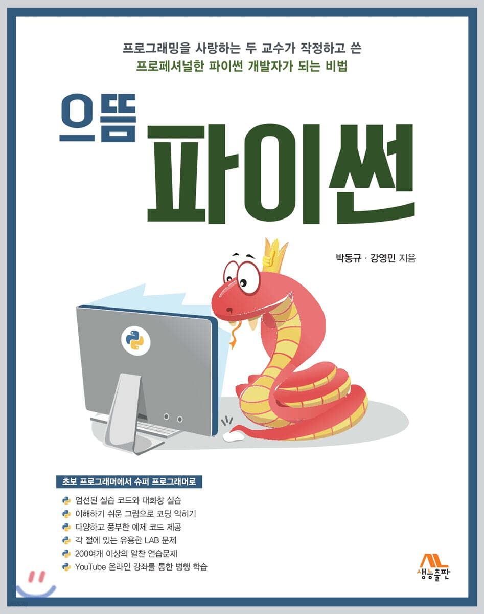 	| * 제목 : 으뜸 파이썬(1판)  * 저자 : 박동규, 강영민  * 출간 연도 : 2020년  * 출간사 : 생능출판사  	|
| 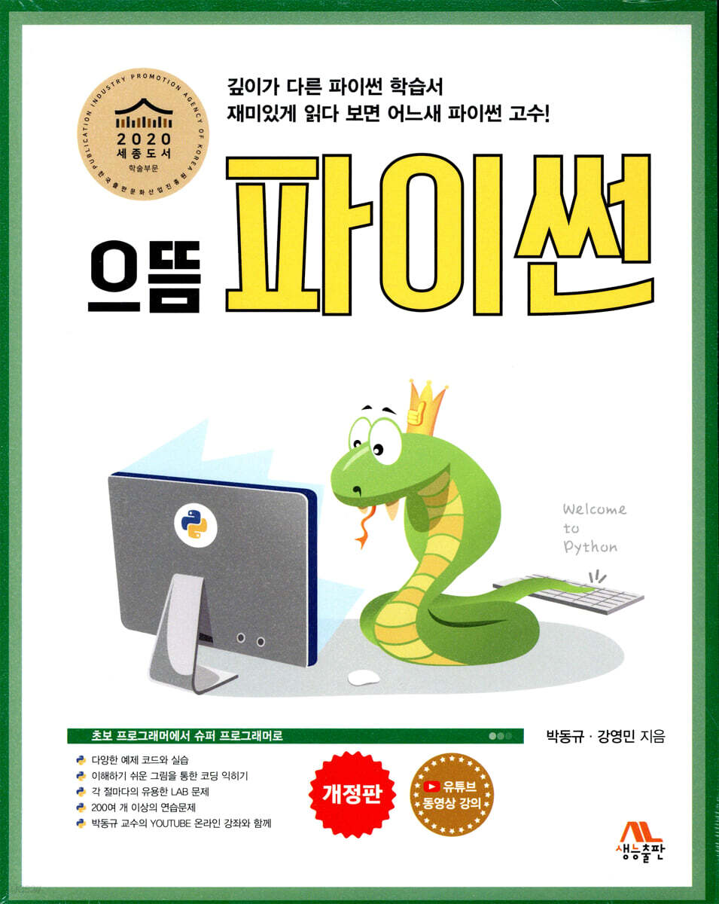 	| * 제목 : 으뜸 파이썬(2판)  * 저자 : 박동규, 강영민  * 출간 연도 : 2024년  * 출간사 : 생능출판사  	|
|  	| * 제목 : 따라하며 배우는 파이썬과 데이터 과학(1판)  * 저자 : 천인국, 박동규, 강영민  * 출간 연도 : 2020년 12월   * 출간사 : 생능출판사  	|
|  	| * 제목 : 따라하며 배우는 파이썬과 데이터 과학(2판)  * 저자 : 천인국, 박동규, 강영민  * 출간 연도 : 2023년 11월  * 출간사 : 생능출판사  	|
| 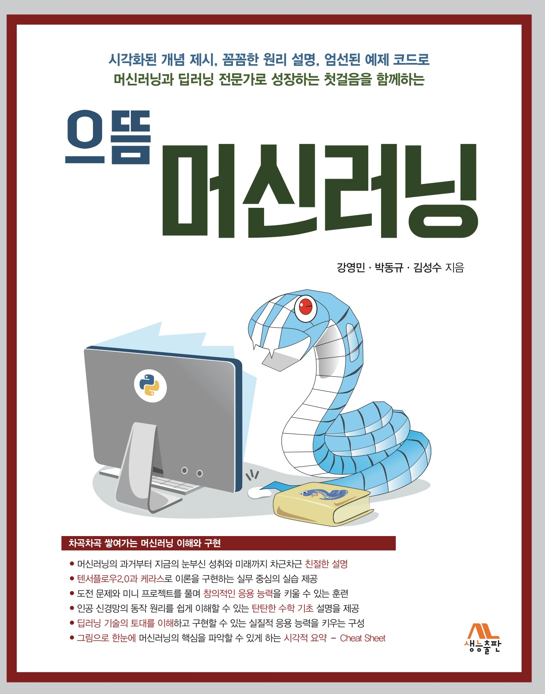 	| * 제목 : 으뜸 머신러닝(1판)  * 저자 : 강영민, 박동규  * 출간 연도 : 2021년 7월   * 출간사 : 생능출판사  	|
| 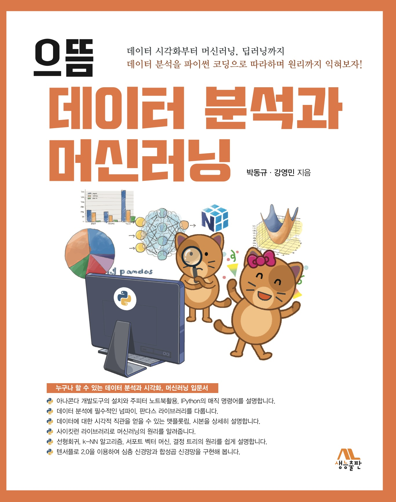 	| * 제목 : 으뜸 데이터분석과 머신러닝(1판)  * 저자 : 박동규, 강영민   * 출간 연도 : 2021년 12월   * 출간사 : 생능출판사  	|
| 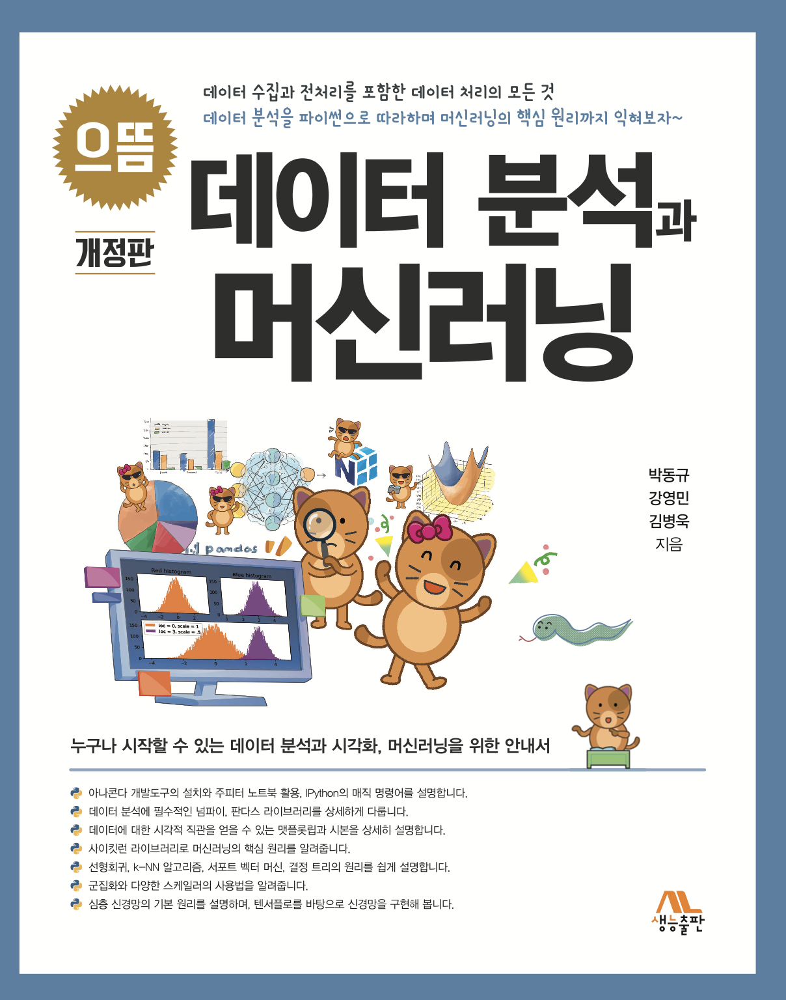 	| * 제목 : 으뜸 데이터분석과 머신러닝(2판)  * 저자 : 박동규, 강영민, 김병욱   * 출간 연도 : 2024년 12월   * 출간사 : 생능출판사  	|
|  	| * 제목 : 으뜸 컴퓨터 개론(1판)  * 저자 : 박동규   * 출간 연도 : 2023년 1월   * 출간사 : 생능출판사  	|
| 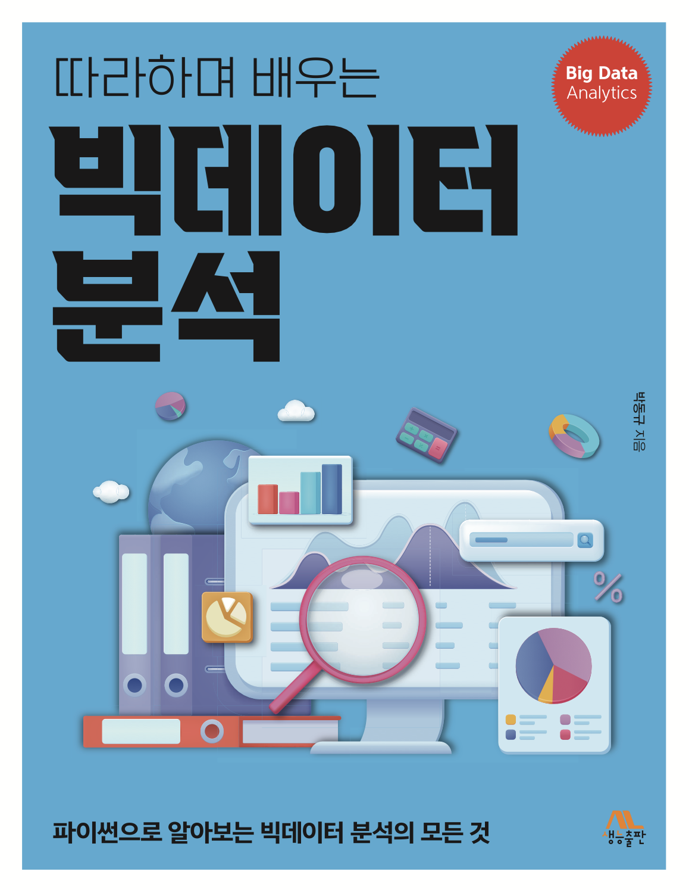 	| * 제목 : 따라하며 배우는 빅데이터 분석(1판)  * 저자 : 박동규   * 출간 연도 : 2024년 11월   * 출간사 : 생능출판사  	|
| 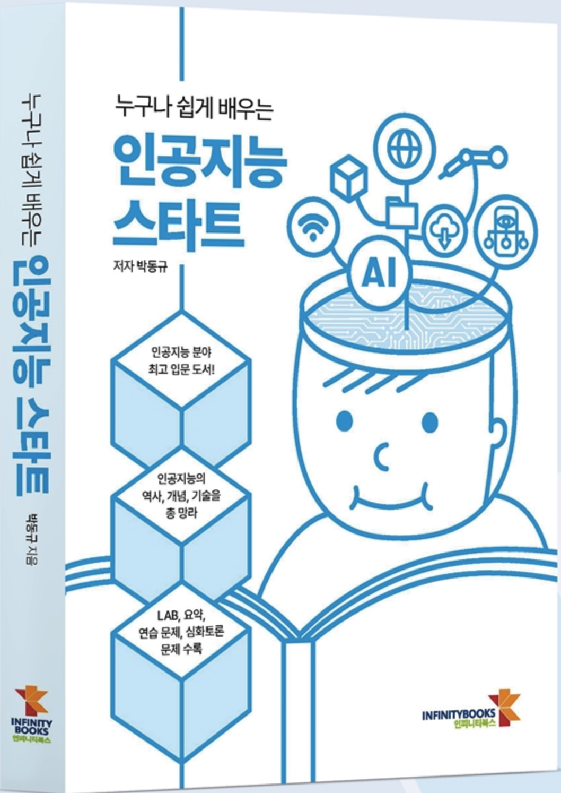 	| * 제목 : 누구나 쉽게 배우는 인공지능 스타트(1판)  * 저자 : 박동규  * 출간 연도 : 2022년 7월   * 출간사 : 인피니티북스 * 비고 : 2023 세종도서선정|
| 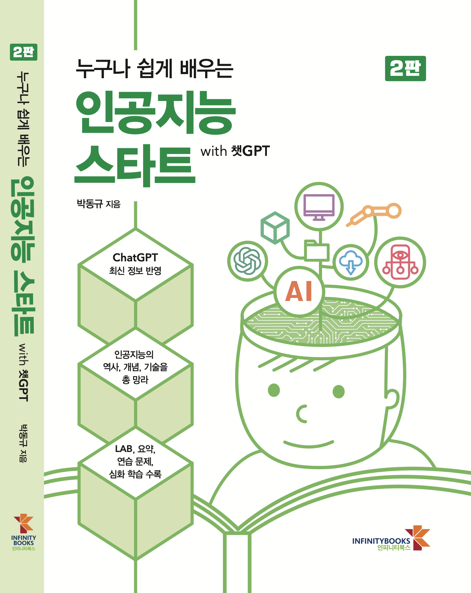 	| * 제목 : 누구나 쉽게 배우는 인공지능 스타트(2판)  * 저자 : 박동규  * 출간 연도 : 2025년 1월   * 출간사 : 인피니티북스  	|
| 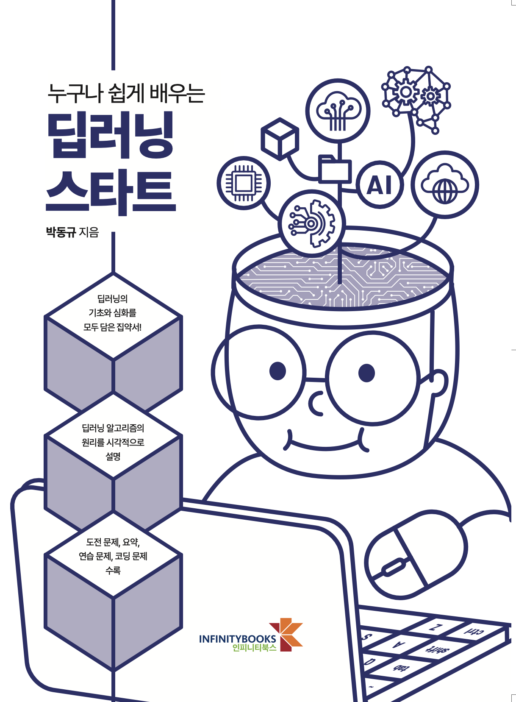 	| * 제목 : 누구나 쉽게 배우는 딥러닝 스타트(1판)  * 저자 : 박동규  * 출간 연도 : 2023년 12월   * 출간사 : 인피니티북스  * 비고 : 2024 세종도서선정|
| 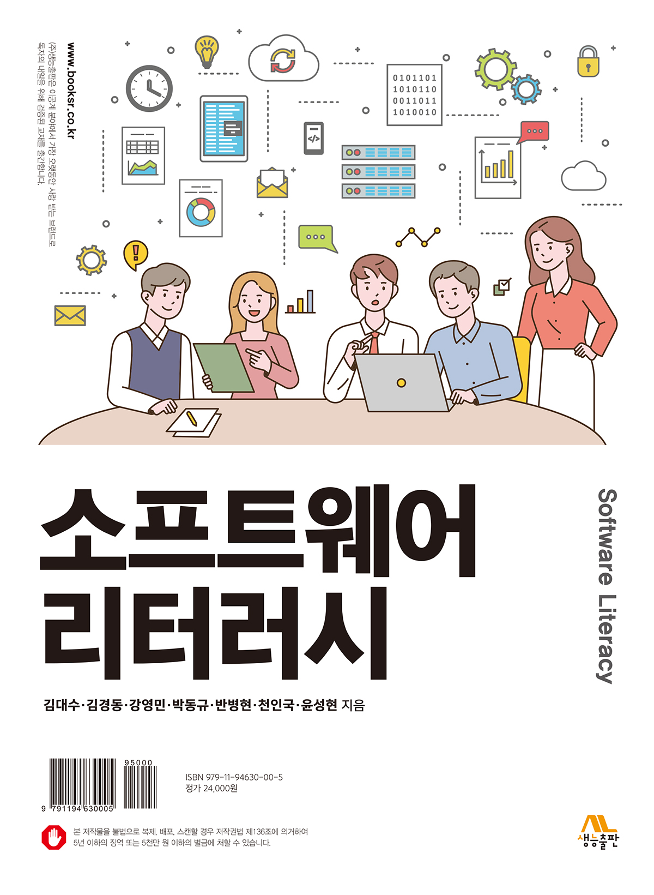 	| * 제목 : 소프트웨어 리터리시(1판)  * 저자 : 김대수, 김경동, 강영민, 박동규, 반병현, 천인국, 윤성현  * 출간 연도 : 2025년 1월   * 출간사 : 생능출판사  * 비고 : 전자책출간|
| 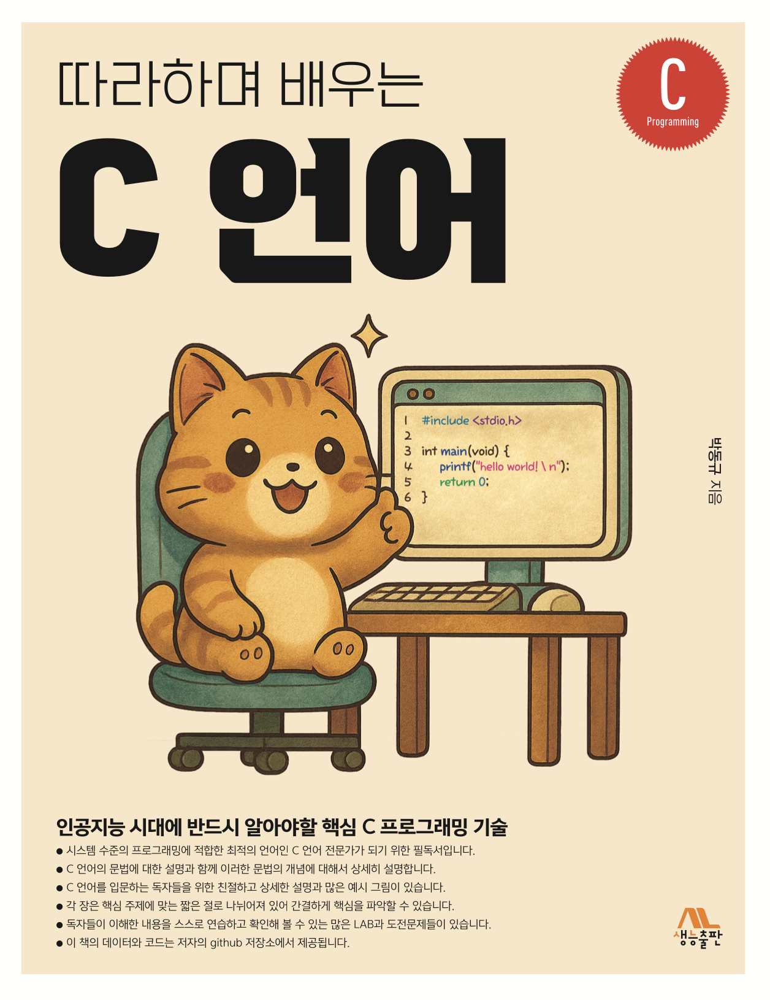 	| * 제목 : 따라하며 배우는 C언어(1판)  * 저자 : 박동규   * 출간 연도 : 2025년 11월   * 출간사 : 생능출판사  	|

